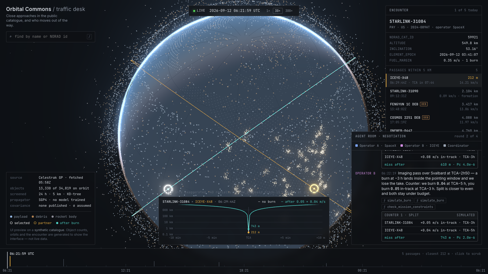

# Orbital Commons

**Autonomous agents for orbital traffic: find the close approaches in the public satellite
catalogue, and negotiate who moves out of the way.**

Built for the *Space Tech & Orbital Sustainability* track — track space debris, optimise
satellite manoeuvre planning, coordinate open-source orbital traffic management.

> Working title. Everything in this repository is written during the hackathon.

## The problem

Roughly 35,000 tracked objects share low Earth orbit. Every day the public catalogue
produces tens of thousands of predicted passes closer than 5 km, and a handful closer than
a few hundred metres. Today, when two *active* satellites are on a collision course, the
two operators email each other. There is no shared protocol for deciding who burns fuel,
when, and how the decision is recorded.

## What we are building

1. **Track** — pull the live catalogue (Celestrak, no account needed), propagate every
   object with SGP4, screen for close approaches over the next 24 h.
2. **Plan** — for each conjunction, compute miss distance, time of closest approach,
   relative speed, and candidate avoidance burns for either side.
3. **Coordinate** — the part that does not exist publicly: one **operator agent per
   satellite**, each holding private constraints (fuel budget, mission windows, burn
   limits), plus a **coordinator agent** that runs the negotiation, re-screens every
   proposed burn for secondary conjunctions, and records the agreement as a
   CDM-shaped message. A human approves the final burn.

The visible product is a single-screen "traffic desk": a live globe of the whole
catalogue, an encounter inspector, a timeline of the day's passages, and an agent room
where the negotiation streams in.

## Status — day 0

| Done | Where |
|---|---|
| Research: what exists, what to learn from, what to avoid | `docs/frontend-research.md` |
| Visual direction and the recipe for every rendering effect | `docs/visual-bible.md` |
| **UI/UX preview** — a real WebGL scene on synthetic data | `docs/preview/` |

Not started: data pipeline, screening, agents, backend. The preview is a look-and-feel
target, not the product — its catalogue, orbits, encounter and negotiation are generated.

### Open the preview

```
open docs/preview/index.html
```

No build step, no server. It loads Three.js from a CDN and needs nothing else. Drag to
orbit, scroll to zoom, click the timeline to scrub; the negotiation replays on a loop.



`docs/preview/template.html` is the source (markup, CSS, the Three.js scene, the scripted
negotiation). `build.py` injects the precomputed land points and writes `index.html`.
`make_land.mjs` regenerates those points from Natural Earth data.

## Planned stack

| Layer | Choice |
|---|---|
| Frontend | Vite · React · TypeScript · Three.js (React Three Fiber) · Zustand · Tailwind |
| In-browser propagation | satellite.js (SGP4) in a Web Worker |
| Backend | FastAPI · sgp4 · numpy / scipy (KD-tree screening) |
| Agents | LangGraph — operator agents + coordinator, tools wrap the physics; the LLM never does orbital maths |
| Data | Celestrak GP (JSON), cached server-side (≤ 1 fetch per group per 2 h) |
| Live stream | Server-Sent Events from backend to the agent room |

## Repository layout

```
docs/
  frontend-research.md   what we studied, verified facts, stack, layout
  visual-bible.md        the look, and how each effect is made
  preview/               the UI preview (open index.html)
```

## Originality

All code here is our own. We studied a number of open-source projects for *technique*
(how they render a globe, how they screen conjunctions, how negotiation agents are
structured) — they are listed with their licences in `docs/frontend-research.md` and
`docs/visual-bible.md`. None of their code is included or copied. AGPL projects were read
for ideas only.

## Data sources

- [Celestrak](https://celestrak.org) — general perturbations element sets
- [Natural Earth](https://www.naturalearthdata.com/) via `world-atlas` — land geometry for the preview globe
