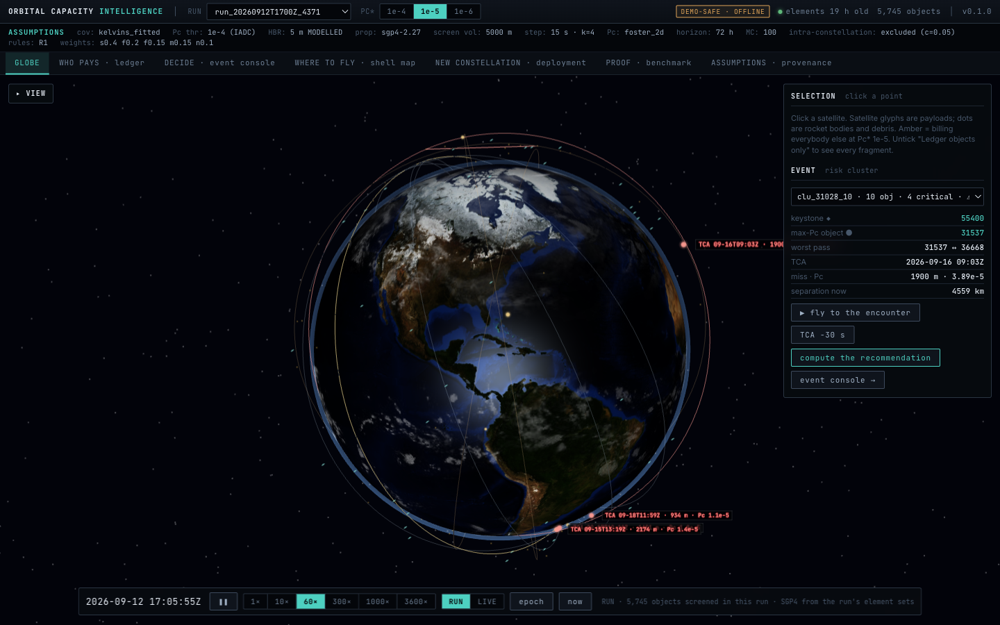
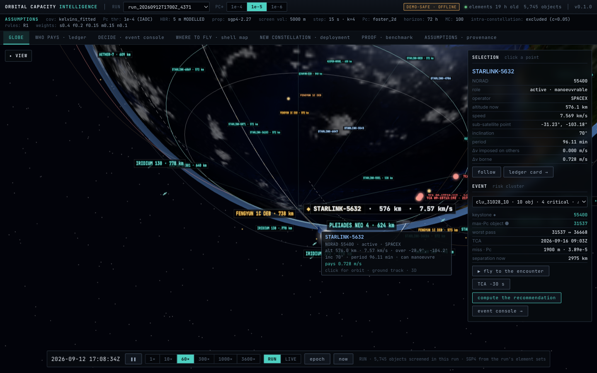
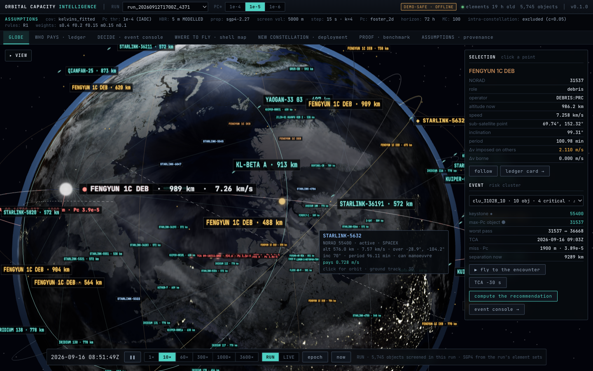
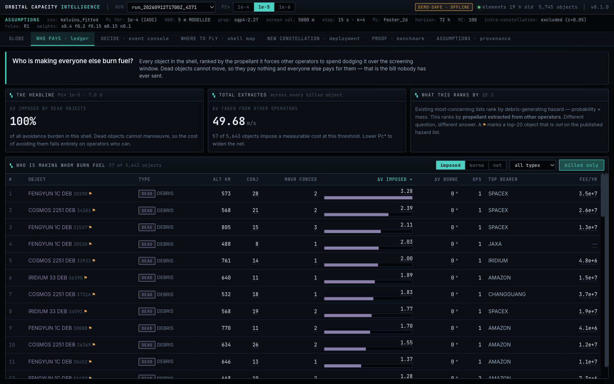
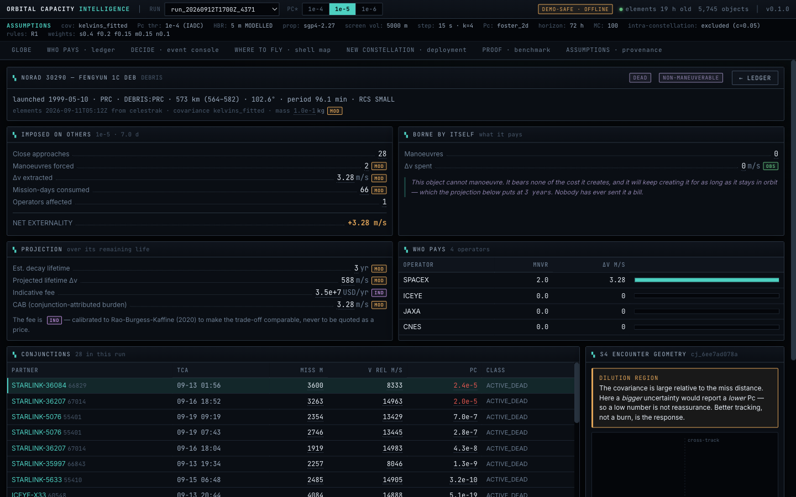
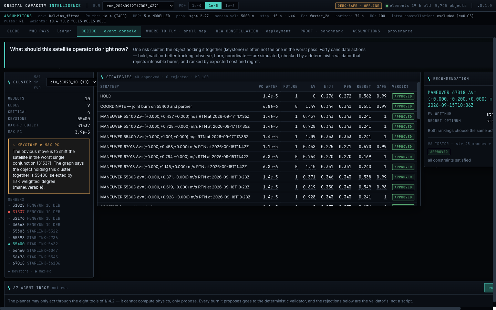
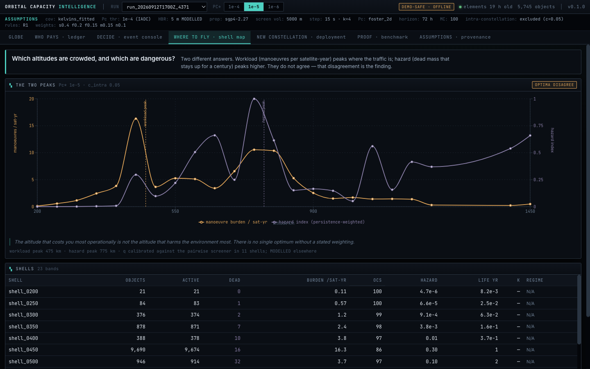
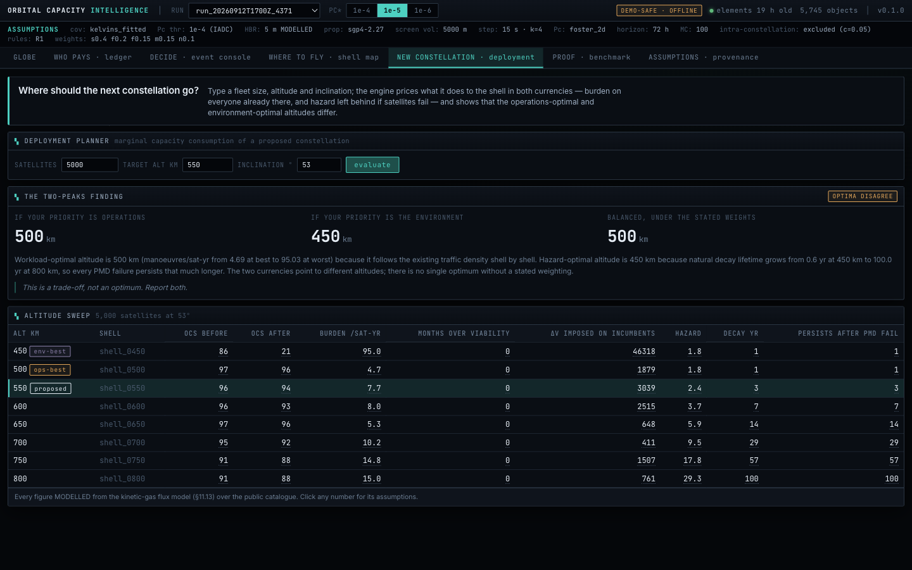
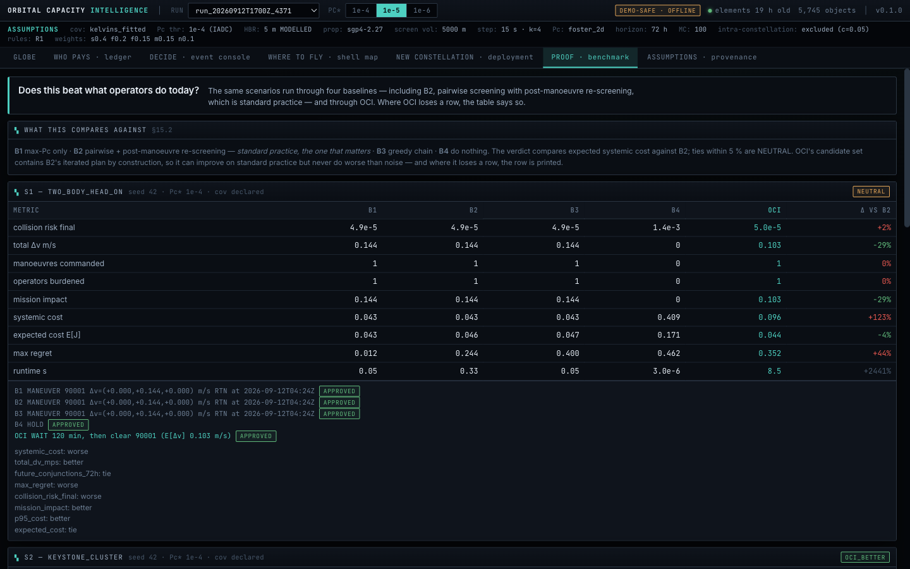

<div align="center">

# Orbital Capacity Intelligence

**Every object in orbit. Who it makes move. What that costs.**

A decision system for orbital sustainability, built on real public data: it screens every close approach in an altitude shell, bills each dead object for the fuel it forces others to burn, decides today's avoidance manoeuvre with a tool-bound planning agent, lets judges perturb the system live, and answers where the next constellation should fly.

[](pyproject.toml)
[](frontend/)
[](tests/)
[](#real-data-only)
[](#run-it)



*Hackathon track: Space Tech & Orbital Sustainability · Team Blank*

</div>

---

## The problem in one minute

Satellites burn propellant dodging each other — and dodging dead junk. A large share of that dodging is forced by objects that are **already dead**: spent rocket bodies, failed satellites, fragments of anti-satellite tests. They cannot move, so they impose the entire cost of avoidance on everyone else, for free, for as long as they stay up — which, at 800 km, is about a century.

Nobody has ever measured that cost **per object**. Existing "most concerning objects" lists rank by debris-generating hazard (probability × mass). That is the environmental question. The operational question — *who is making whom burn fuel, and how much?* — has no ledger.

This project builds it, and then uses it.

## What it does

| | |
|---|---|
| **1. The globe** | Every object in the screened shell (5,745 in the demo run) — or the whole public catalogue in LIVE mode (19,234 objects) — propagated with SGP4 in the browser from the same element sets the backend screened. Hover: name, operator, live altitude, speed, ground position. Click: orbit, ground track, coverage footprint, 3D model. Amber objects are the ones billing everybody else. |
| **2. The ledger** | For every object: close approaches it generated, manoeuvres it forced, Δv it extracted from other operators, mission-days consumed, who paid, and the projected cost over its remaining life. Dead objects bear zero of it — that is the point. |
| **3. The decision** | One risk cluster at a time: an interaction graph finds the *keystone* (often not the object in the worst pass), 40 candidate actions — hold, wait for better tracking, observe, burn, coordinate — are simulated against the cluster's neighbourhood with uncertainty sampling, a deterministic validator rejects the infeasible ones with a reason, and three rankings (expected cost, p95, minimax regret) are shown side by side. |
| **4. The planning agent** | Reasons only through eight tools; it cannot compute physics, only propose. Every number in its explanation is checked against the tool results by a fabrication guard. Works with no LLM key (deterministic driver). |
| **5. Chaos mode** | Inject a new fragment on the recommended trajectory, a tracking gap, a refused coordination, an uplink delay… the standing recommendation is invalidated with the reason and the cluster is replanned in ~7 s, with a `was / now / why` diff. |
| **6. Capacity** | A kinetic-gas flux model over 50-km shells, calibrated against the pairwise screener, gives each shell a workload score and a hazard index. They peak at different altitudes. The deployment planner prices a new constellation in both currencies and refuses to collapse them into one number. |
| **7. The benchmark** | The same scenarios through four baselines — including what operators do today — and through OCI. Where OCI loses a row, the table says so. |
| **8. Provenance** | Every displayed figure is `OBSERVED`, `COMPUTED`, `MODELLED` or `INDICATIVE`, carries the function that produced it and its assumptions, and is never a silent zero. Click any number for the math. |

## Screens

<table>
<tr>
<td width="50%"><br><sub><b>Globe · a satellite.</b> Hover card with live altitude, speed and ground position; selection shows orbit, ground track, footprint cone and a 3D model; name tags on every object in the story.</sub></td>
<td width="50%"><br><sub><b>Globe · the encounter.</b> "Fly to the encounter" follows the worst pass of the cluster to its TCA with the live separation ticking down; a chosen manoeuvre is drawn as the orbit before (dashed) and after the burn.</sub></td>
</tr>
<tr>
<td><br><sub><b>Who pays · the ledger.</b> Ranked by Δv extracted from other operators. Flip to <i>borne</i> and every dead object drops to zero: 100 % of the avoidance burden in this shell comes from things that are already dead.</sub></td>
<td><br><sub><b>One object's bill.</b> NORAD 30290, a Fengyun-1C fragment: 2 manoeuvres forced, 3.28 m/s extracted from SpaceX in one week, nothing borne, three more years in orbit — and every pass that produced those numbers.</sub></td>
</tr>
<tr>
<td><br><sub><b>Decide · the event console.</b> Keystone ≠ max-Pc object flagged; 40 strategies with post-action Pc, Δv, expected cost, p95, regret and safe fraction; the validator's verdict on each; the planner's tool trace below.</sub></td>
<td><br><sub><b>Where to fly · the two peaks.</b> Workload (manoeuvres per satellite-year) peaks where the traffic is; the hazard index peaks higher, where dead mass stays for a century.</sub></td>
</tr>
<tr>
<td><br><sub><b>New constellation.</b> 5,000 satellites at 53°: operations-optimal and environment-optimal altitudes differ — the planner reports both and the balanced pick under stated weights.</sub></td>
<td><br><sub><b>Proof.</b> B1 max-Pc only · B2 pairwise + post-manoeuvre re-screening (standard practice) · B3 greedy chain · B4 do nothing, versus OCI, per scenario, with the rows where OCI loses printed.</sub></td>
</tr>
</table>

## How it works

```mermaid
flowchart LR
  A[CelesTrak GP + SATCAT<br/>public element sets] --> B[M1 ingest<br/>provenance, MODELLED masses]
  B --> C[M2 SGP4 propagation]
  C --> D[M3 screening<br/>15 s grid · spatial index · TCA refinement · Foster Pc]
  K[ESA Kelvins<br/>162k real CDMs] --> Kf[covariance fit<br/>σ(τ) + shrinkage λ]
  Kf --> D
  D --> E[M4 interaction graph<br/>clusters · keystone]
  D --> F[M5 externality ledger<br/>rule R1: dead → active]
  E --> G[M6 pure simulator]
  G --> H[M7 optimiser<br/>40 strategies · Monte Carlo · 3 rankings]
  H --> I[M9 validator C1–C10]
  I --> J[M11 planning agent<br/>8 tools · fabrication guard]
  G --> L[M14 chaos<br/>inject → invalidate → replan]
  B --> M[M10 capacity<br/>flux model · OCS · hazard · κ]
  H --> N[M15 benchmark B1–B4]
  J & F & M & L & N --> O[M12 REST API<br/>33 endpoints · Traced on the wire]
  O --> P[M13 frontend<br/>globe · ledger · console · shells]
```

Three design rules run through everything:

- **Every number is `Traced`.** `{value, unit, label, function, assumptions, na_reason}` — on disk, on the wire, on screen. A missing value is `null` with a reason, never `0`. A test walks every API response and fails on a bare float.
- **The simulator is a pure function of state.** `recommend(chaos(state, injection))` is all chaos mode is; no hidden caches, no database side effects.
- **The AI proposes, deterministic code disposes.** The planner cannot compute physics; the validator's rejections are the validator's, and if the rejected list were always empty the loop would be theatre.

## Real data only

| Source | Used for | Access |
|---|---|---|
| **CelesTrak GP element sets** — active, stations, and the Fengyun-1C / Cosmos-2251 / Iridium-33 / Cosmos-1408 debris groups | every object's orbit | public, no account |
| **SATCAT** | object type, owner, RCS class, launch and decay dates | public |
| **CelesTrak SOCRATES** | independent cross-validation of the screener | public |
| **ESA Kelvins Collision Avoidance Challenge** — 162,634 real conjunction data messages | fitted position covariance vs time-to-TCA, and the shrinkage model behind WAIT | public dataset |

There is no synthetic data on any live screen. The four synthetic scenarios in `oci/data/synthetic.py` exist for the test suite and the benchmark, and are labelled `scenario:` wherever they appear.

## Measured results (12 Sep 2026 data)

- **Screening vs SOCRATES, same element sets: 99 % recall** (98/99), TCA agreement to the millisecond, miss distance within 0.5 m.
- **Real 500–1000 km shell, 5,745 objects, 7 days:** 29,078 close approaches within 5 km. The ledger at Pc* 1e-5 attributes every forced manoeuvre to Fengyun-1C and Cosmos-2251 fragments — 57 dead objects, 49.7 m/s extracted, 16 operators paying, 100 % of the burden from dead objects.
- **Covariance is fitted, not invented:** `log10 σ = a + b·log(1+τ) + type + altitude` on 12,787 real events; along-track R² 0.54; our Pc correlates 0.68 with ESA's own risk field.
- **WAIT is measured:** uncertainty shrinks 41 %/day toward TCA (λ = 0.53/day). Replaying 10,638 real events: 51 WAIT recommendations, 39 correct, 12 dangerous, 0.65 m/s saved per correct wait — the dangerous count is printed next to the saving.
- **The two peaks reproduce from the public catalogue:** workload peak 450–500 km, hazard peak 750–800 km; flux model and pairwise screener agree within a factor 0.6–1.1 in the eight shells both cover.
- **Benchmark:** S1 tie, S2 OCI better on regret with the same plan as standard practice, S3 OCI better, S5 tie.
- **Chaos replan: 6–8 s.** Strategies on a real-run cluster: ~11 s. Screening the shell: 74 s.

Full numbers: [docs/BENCHMARK.md](docs/BENCHMARK.md) · [docs/KELVINS.md](docs/KELVINS.md) · [docs/CAPACITY.md](docs/CAPACITY.md) · [docs/ASSUMPTIONS.md](docs/ASSUMPTIONS.md).

## Run it

Requirements: Python 3.13, Node 20+. Everything below works with the network off after the first run (the demo run and the catalogue are cached).

```bash
make setup            # Python venv + package
make ui-setup         # frontend dependencies
```

Two terminals:

```bash
make api-safe         # REST API on :8000, offline mode (cached run, no network calls)
```

```bash
make ui               # frontend on http://localhost:5173
```

Open http://localhost:5173 — it opens on the globe. Use `make api` instead of `make api-safe` to let the API pull fresh element sets from CelesTrak.

Terminal-only, no browser:

```bash
make demo                                   # the full pipeline on a scenario, with the planner
python -m oci screen --alt-low 500 --alt-high 1000 --hours 168   # screen a real shell
python -m oci ledger --threshold 1e-5       # the externality ledger for that run
python -m oci chaos --inject NEW_OBJECT     # perturb, invalidate, replan
python -m oci capacity --offline            # shell map + deployment table
python -m oci bench                         # baselines vs OCI
make test                                   # 155 tests, offline
```

The 2:45 demo script — what to click, what to say — is in [docs/VIDEO_SCRIPT.md](docs/VIDEO_SCRIPT.md); the stage script with Q&A is in [docs/DEMO.md](docs/DEMO.md).

## Repository layout

```
oci/
  config.py            every tunable, with its citation or MODELLED label
  labels.py            Traced — the number type everything else is built on
  data/                CelesTrak / SATCAT / SOCRATES / Kelvins clients, ingest, operator map, scenarios
  physics/             SGP4 propagation, screening, encounter geometry, Pc, manoeuvres, decay
  graph/               interaction graph, clusters, keystone
  ledger/              attribution rules and the externality ledger
  sim/                 the pure simulator and chaos injections
  decide/              optimiser, value of information, validator
  agent/               the eight tools, the planner, the fabrication guard
  capacity/            shells, flux model, OCS, hazard, κ, deployment
  bench/               baselines B1–B4 and the harness
  api/                 FastAPI: 33 endpoints, envelope, RFC 7807 errors, jobs
frontend/              React 18 + Vite + Three.js: globe, ledger, event console, shells, deployment, benchmark, provenance
tests/                 155 acceptance tests, all offline
docs/                  generated reports, assumptions register, demo scripts, screenshots
models/                the Kelvins-fitted covariance model (committed)
```

## What it is not

Public element sets carry kilometre-scale error and no covariance, so this computes **relative burden and decision quality, not operational collision probability**. It cannot see most manoeuvres. Attribution between two live satellites is genuinely arguable — which is why it starts with the dead ones, where it is not. This is decision support. It is not a flight command.

## Team

**Team Blank.** Built during the hackathon, from a written specification, with all code original to this repository. Prior art this stands on — the conjunction-network idea, orbital capacity modelling, the orbital-use fee, per-object risk ranking — is credited in [docs/PRIOR_ART.md](docs/PRIOR_ART.md).
